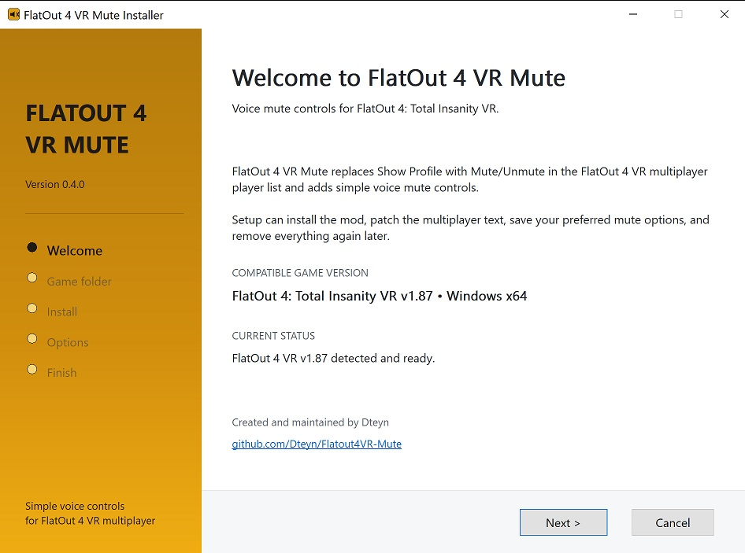
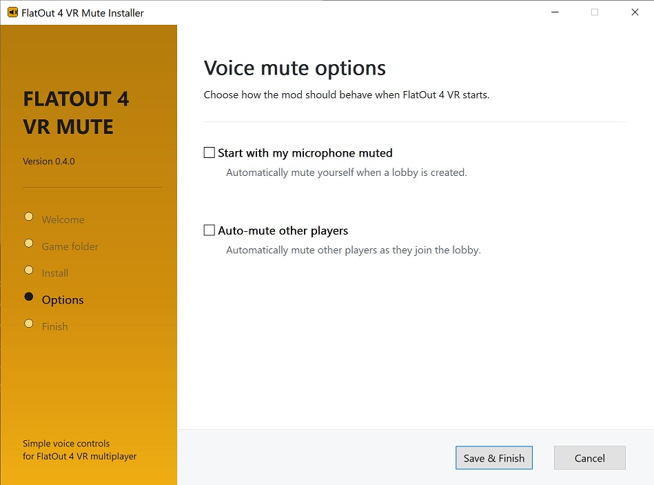

# FlatOut 4 VR Mute


Adds voice-chat mute controls to [FlatOut 4: Total Insanity VR](https://store.steampowered.com/app/3844750/FlatOut_4_Total_Insanity_VR/) by repurposing the multiplayer Show Profile button and changing it to a Mute/Unmute button.

## Current Version

Latest release: [**Version 0.4.0**](https://github.com/Dteyn/Flatout4VR-Mute/releases/tag/v0.4.0)

Game version supported: **FlatOut 4: Total Insanity VR v1.87** only

## Contents
 
- [Installation](#installation)
- [Usage](#usage)
  - [Host has a Mute/Kick submenu](#host-has-a-mutekick-submenu)
- [Changing settings, repairing, or uninstalling](#changing-settings-repairing-or-uninstalling)
- [Settings file: `fl4tout_voip_mute.ini`](#settings-file-fl4tout_voip_muteini)
- [Manual install (no installer)](#manual-install-no-installer)
  - [Even more manual install](#even-more-manual-install)
- [Technical Summary](#technical-summary)
- [Build from Source](#build-from-source)

## Installation

1. Download the latest installer here: [Flatout4VR-Mute-0.4.0.zip](https://github.com/Dteyn/Flatout4VR-Mute/releases/download/v0.4.0/Flatout4VR-Mute-0.4.0.zip)
2. Extract the ZIP somewhere, such as Downloads.
3. Run **FlatOut4VR-Mute-Installer.exe** and follow the prompts.

Installer window:


4. The installer looks for your FlatOut 4 VR folder under your Steam libraries. Confirm it, or browse to it yourself.

5. Click Install, then choose the mute options you want.

You can choose to start with your microphone muted, and auto-mute other players:



Once finished, start the game and you should see the 'Show Profile' option changed to 'Mute/Unmute' in the menu options.

## Usage

The mod repurposes the lobby's Show Profile action (Y on an Oculus controller, or whatever it's bound to for you), and changes it to **Mute/Unmute**.

To Mute/Unmute yourself or another player, highlight player name and press Y. Pressing Y again will toggle mute on/off.

When a player is muted, you should no longer see the 'speaker' icon appear for that player.

### Host has a Mute/Kick submenu

When you're the lobby host, selecting the mute option will pop up a submenu with options for 'Mute Player' or 'Kick Player'.

- 'Mute Player' is a toggle; selecting it again will unmute the player. 
- 'Kick Player' is a default feature of this submenu - just a nice bonus!

## Changing settings, repairing, or uninstalling

Run the installer again. It will offer Repair, Change Voice Mute Options, or Uninstall instead of a fresh install.

The installer shows two checkboxes:

- Start with my microphone muted
- Mute other players by default

You can change these options at any time by re-running the installer.

## Settings file: `fl4tout_voip_mute.ini`

You can also change settings by editing the `fl4tout_voip_mute.ini` file in the FlatOut 4 VR folder.

A default config looks like this:

```
; FlatOut 4 VR Mute v0.4.0
; Officially supported game build: FlatOut 4: Total Insanity VR v1.87 x64.
; The mod is always active while installed. Remove the mod files to disable it.
; Settings are loaded once at startup. Restart the game after editing this file.

[General]
; 1 starts with your local voice transmission muted. Default: 0.
; With AllowUnmute=1 (default), you may manually unmute yourself afterward.
AlwaysMuteSelf=0

; 1 automatically mutes received voice from occupied remote player slots. Default: 0.
; With AllowUnmute=1 (default), you may manually unmute individual remote players afterward.
AlwaysMuteOthers=0

; 1 allows manual Mute/Unmute actions to override enabled AlwaysMute policies. Default: 1.
; Set to 0 to keep enabled AlwaysMute policies locked and prevent accidental unmuting.
AllowUnmute=1
```

The third option, `AllowUnmute` isn't shown in the installer. It's enabled by default, so you can always manually mute or unmute yourself or another player.

If you always use Discord or another external voice app and want to stop accidental in-game unmuting, set `AllowUnmute=0` in `fl4tout_voip_mute.ini`. This will disable the mute/unmute toggle to prevent accidental unmuting.

## Manual install (no installer)

If you'd rather not run the installer exe, for example because your antivirus flags it (the installer source is on this repo if you want to check it yourself), you can install the mod by hand instead. 

Download the separate `-manual-install.zip` file from the [Releases](https://github.com/Dteyn/Flatout4VR-Mute/releases/latest) page.

Direct link: [Flatout4VR-Mute-0.4.0-manual-install.zip](https://github.com/Dteyn/Flatout4VR-Mute/releases/download/v0.4.0/Flatout4VR-Mute-0.4.0-manual-install.zip)

This .zip contains just 5 files:

```text
fl4tout_voip_mute.dll
fl4tout_voip_mute.ini
version.dll
patch_localization.py
readme.txt
```

1. Copy all files into your FlatOut 4 VR game folder (same folder as Flatout.exe).
2. Double-click `patch_localization.py` (requires [Python 3](https://www.python.org/)). The Python script finds the game folder automatically, backs up the original localization files to `Common\Localisation\BACKUP`, and changes "Show Profile" to "Mute/Unmute" in every supported language.
3. Start FlatOut 4 VR.

If uninstalling the mod and you want to restore the text back to "Show Profile", run `patch_localization.py` again to restore the text.

# Technical Summary

A technical summary on how the mod works, including the custom installer, can be found here: [TECHNICAL-SUMMARY.md](TECHNICAL-SUMMARY.md).

# Build from Source

For a guide on building from source, see here: [BUILD-FROM-SOURCE.md](BUILD-FROM-SOURCE.md).

# Support

If you find this useful and wish to support the developer: https://ko-fi.com/Dteyn

You are visitor: 